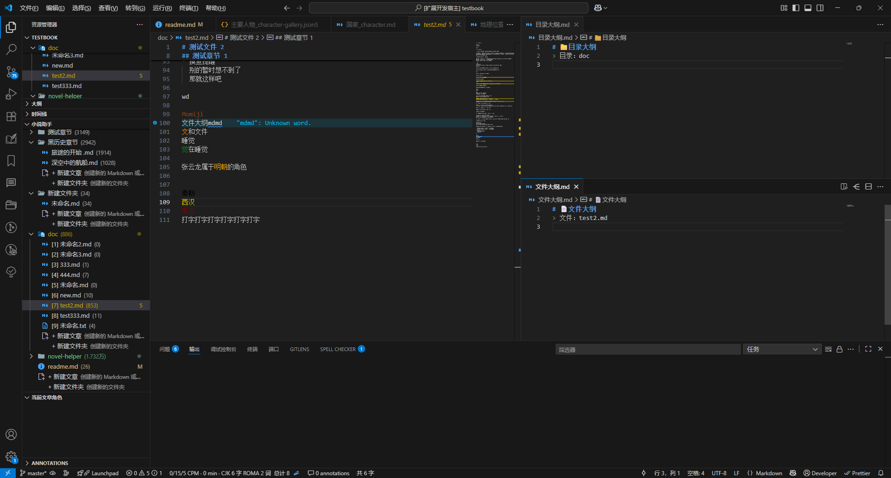
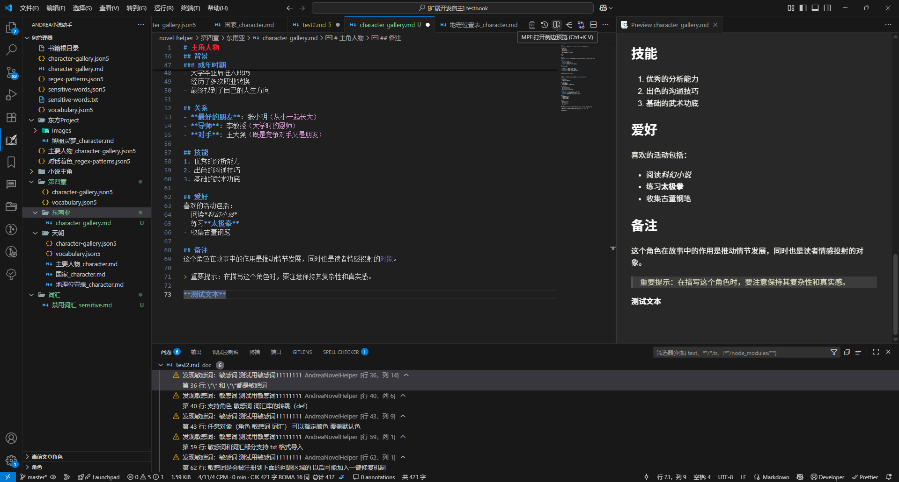
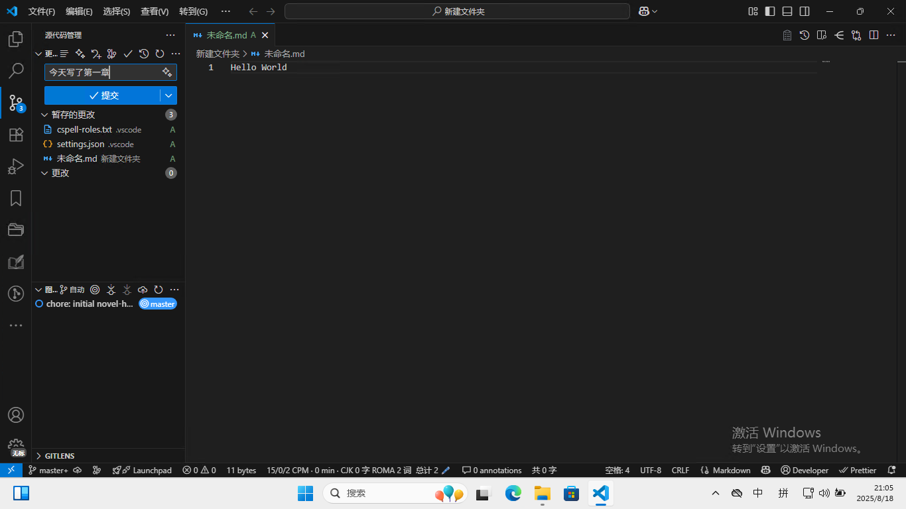

# 安装

### 便携安装（对于普通用户）

1.  下载安装包

2.  

选择 是

选择安装语言

设置用户名密码

最后会自动在桌面上创建图标 根据提示 启动两次就自动设置为中文

第一次启动

第二次启动

**显示为中文即为便携安装完成**

### 全量安装（对于专业用户）

#### 第一步 下载 Git 和编辑器

1.  Git 官网：https://git-scm.com/downloads

2.  加速下载（选普通下载）：<https://pc.qq.com/detail/13/detail_22693.html>

3.  

4.  选择 是

5.  

6.  Next

7.  

8.  根据情况选择

9.  

10. 默认编辑器不会用 vim 可以用别的 （推荐 vscode）

11. 

12. （如果选择 vscode）

13. 

14. Next

15. 

16. 可选第二个或者第三个

17. 

18. Next

19. 

20. Next

21.   
    Next

22.   
    这个随便选

23.   
    Next

24.   
    Next

25.   
    点击安装即可

26.   
    Git 安装结束

<!-- -->

1.  安装 VSCode

    1.  官网：<https://code.visualstudio.com/>

    2.    
        我同意 下一步

    3.  建议全勾上

    4.  

    5.  安装

    6.  

    7.  安装完成（运行）

    8.

#### 安装小说助手

9.  

10. 点击扩展按钮 搜索 Andrea Novel Editor

11. 

12. 安装合集

13. Ctrl Shift P

14. 

15. 配置语言为中文

16. 

17. 配置图标主题

18. 

19. 个人建议使用 Material（当然主题 图标主题 美化 你可以自己在插件商店下载）

20.

# 使用

## 新建书籍项目 

使用打开文件夹打开一个空白文件夹（这会是一本书的存储地点）

我们打开一个新建文件夹

点击信任

第一次使用 先配置 git 信息

输入用户名（任意（最好是英文））

邮箱（最好真的能用 这个用来绑定云存储）

回车即可

选择全局

会看到提示 运行向导来创建小说项目

选择初始化仓库

选择创建示例结构

  
需要云同步写作进度可以纳入 但是没必要

根据推荐来选择即可

是 创建初始提交

是 执行

关闭即可 初始化小说项目完成

## 写作资源管理器（全文字数统计）

新建文件夹 新建新的一卷

右键第一卷 可以选择章节排序方式（默认使用名称排序）

如

第一章

第二章

或者

1 xxx

2 xxx

点击切换手动排序 可以切换成手动排序（类似传统码字软件）

点击新建文章 选择章节格式（markdown（更强大） 或者 txt）

输入文件名

手动排序模式下 前面的数字是第几章

所有模式下 后面的数字是字数

打开文件的情况下 点击大纲按钮打开大纲

会自动创建文件夹和文件的大纲

所有的窗体都是一样的 可以拖动

（编辑的时候记得保存！ 或者你开自动保存也行）

可以自定义工作区的形状

## 敏感词识别

点击警告按钮 可以查看文章有什么问题

选择问题面板 查看问题

点击问题可以转跳到问题出处

## 智能补全和提示

设置完设定集后 输入时可以根据设定集补全

有设定集的内容可以高亮着色

具体描述和着色参照设定集

如果角色写了别名 可以替换为别名

按住 Ctrl+鼠标左键 可以转跳到设定集

当前文章角色的功能类似

## 设定集管理器

点击小说助手按钮打开设定集管理器

右键任意目录 可以创建设定集（子目录/包）和设定集文件

以创建角色库为例子

会询问文件名

选择格式

Md 和 json5 功能比较强大

但是 md 更可读

以 md 为例

md 文件中 选中文本 可以快速指定格式

点击 MPE 预览按键 打开预览

修改完设定集后会自动加载

本着万物皆角色的理念 设定集可以描述任何东西

甚至支持插入图片

json5 格式的设定集

你可以把鼠标放在色块上改变颜色（记得保存）

每天写完记得保存进度 这样你能出问题了恢复到上个版本！

## 写作统计

点击下面的字数统计可以打开码字统计面板

这是内容

## 导出 预览 和 读稿器

点击 OpenPreview 打开预览和读稿器（测试版）

点击播放即可读稿

## 界面美化

百度查询 vscode 美化教程
