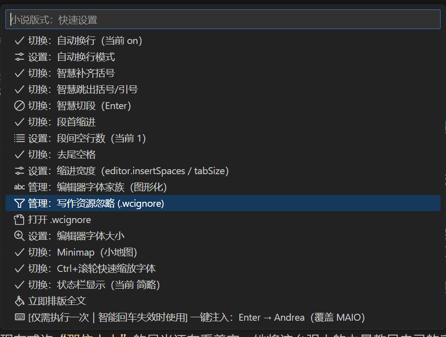
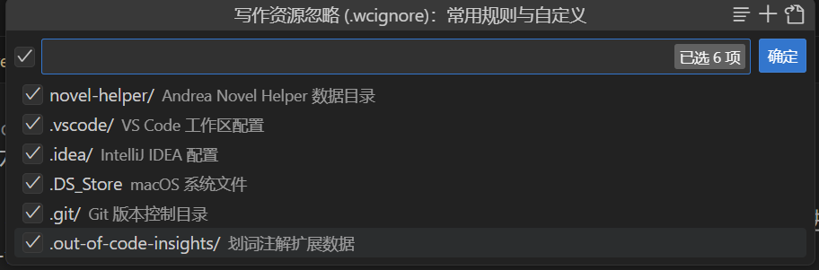
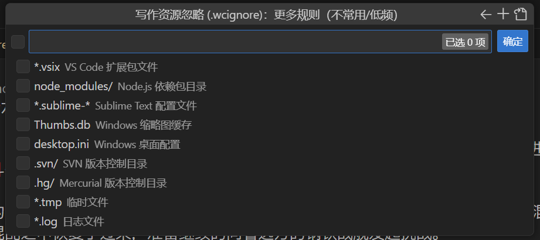

> **小说助手官网：** [https://anh.sirrus.cc](https://anh.sirrus.cc)

# 小说助手 0.3.24 版本发布 新功能介绍和教程

🎉 **版本 0.3.24 发布成功！**

## 功能预览

## 📋 完成的工作

### ✅ 版本更新

- **版本号**: 0.3.23 → 0.3.24
- **发布日期**: 2025-09-06

### ✅ Git 提交

- 提交信息: `feat: v0.3.24 - 新增wcignore快速设置和gitignore语法高亮，优化TimeStats性能`
- 包含 15 个文件更改，1406 行新增，126 行删除

## 🆕 新版本特性

### ✨ 新增功能

- **wcignore 快速设置**: 新增了 wcignore 文件的快速设置功能
- **gitignore 语法高亮**: 新增了 gitignore 文件的语法高亮支持

### 🐛 修复和优化

- **TimeStats 性能优化**: 略微优化了 TimeStats 的性能，减少大文件打开时的阻塞
- **异步计算改进**: 改进了异步计算的错误处理机制

## 🔗 相关链接

- [VS Code 市场页面](https://marketplace.visualstudio.com/items?itemName=andreafrederica.andrea-novel-helper)
- [OpenVSX 市场页面](https://open-vsx.org/extension/andreafrederica/andrea-novel-helper)
- [GitHub 仓库](https://github.com/AndreaFrederica/andrea-novel-helper)

新版本已经成功发布到市场，用户现在可以更新到最新版本 0.3.24 来体验这些新功能和性能优化！
