> **小说助手官网：** [https://anh.sirrus.cc](https://anh.sirrus.cc)

# 小说助手 0.3.25 版本发布 新功能介绍和教程

## [0.3.25] - 2025-09-07

### ✨ 新增

- 新增展开状态持久化功能：所有角色视图、当前文章角色视图（侧边栏和 Explorer）、包管理器视图现在都会记住用户的展开/折叠状态
- 新增跨文档展开状态继承：切换到新文档时，如果新文档尚无展开记录，可继承上个文档的展开集合（仅对共有的节点生效）
- 新增设置开关 `AndreaNovelHelper.docRoles.inheritExpandedFromPrevious`：控制是否启用跨文档展开状态继承（默认开启）
- 新增角色展开显示功能：角色节点支持展开显示详细信息，包括名称、类型、颜色等字段
- 优化角色显示：支持角色自带 SVG 图标、角色名彩色方块标记、颜色字段可视化显示
- 新增角色详情键图标映射：基于 JSON 配置为不同类型的角色字段显示对应的 VS Code 内置图标
- 写作资源管理器现在支持显示参考资料（如图片、PDF 等不计入字数统计的文件）
- 支持基于自定义分类的角色显示，可以按类型或归属进行更灵活的分组

### 🐛 修复

- 修复角色视图展开状态在重启 VS Code 后丢失的问题
- 修复切换文档时布局被重置的问题
- 略微优化了 Decorations 性能，减少大文件打开时的阻塞

### 🖋️ 更改

- 改进角色树视图的 ID 计算稳定性，确保展开状态正确持久化
- 优化展开状态的存储机制，使用 workspaceState 进行跨会话持久化

## 新功能预览

### 自定义分组

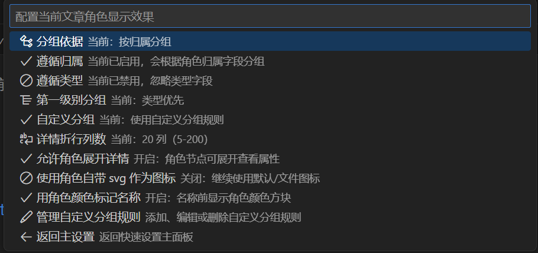
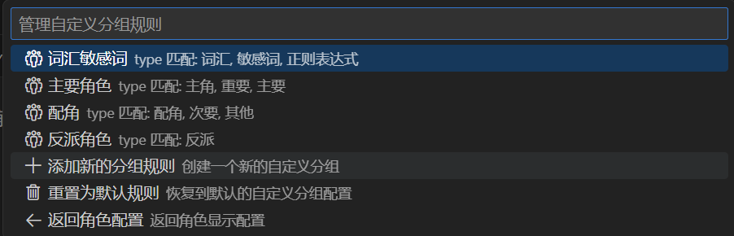

### 展开角色

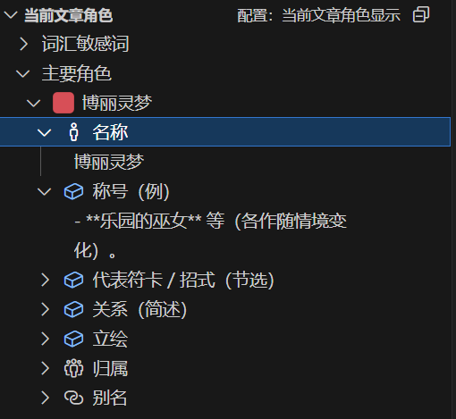

## 教程部分

### 图文教程-创建自定义分组


打开角色显示设置选项卡

点击管理自定义分组规则进入自定义分组规则页面


选择添加规则后输入分组名称

选择匹配的类型（匹配归属还是类型）

输入匹配的条件(分隔符是英文逗号)
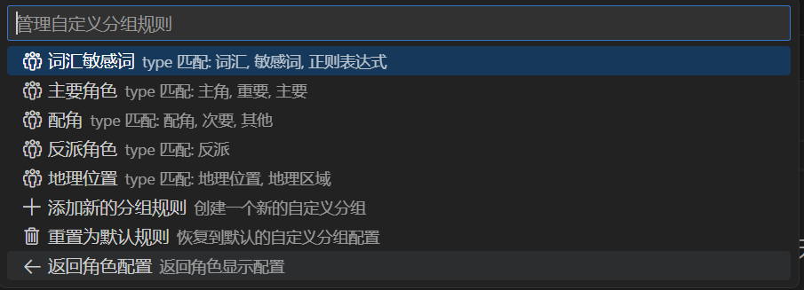
创建完成 页面手动刷新后即可看到新分组（这个版本暂未实现自动刷新）
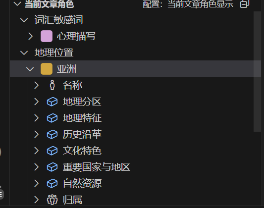
创建完成后 即可看到新的分组

### 展开角色的描述多行文本换行的设置

> 受限于正常手段我们无法完全控制 TreeView 的 DOM，ANH 对于角色细节的描述形式是通过手动拆分为多行文本实现的，默认这个阈值是 20 字符。但是如果你使用了不同的侧边栏宽度 你会需要手动设置这个参数。

#### 不正确的宽度设置

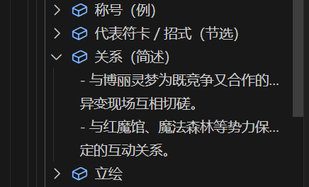
宽度过窄，一行显示不完全
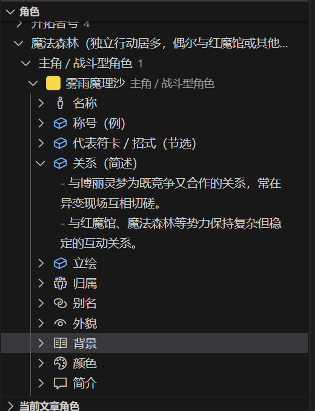
宽度正常，显示正常
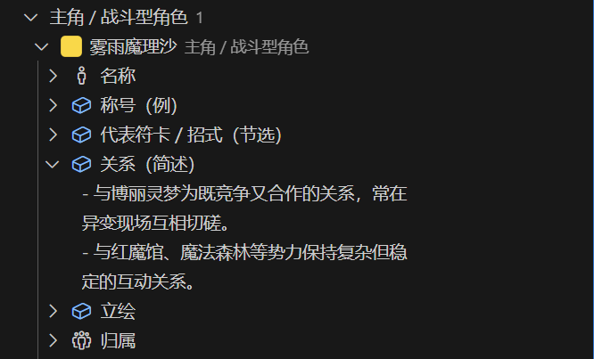
宽度过宽，浪费空间

#### 如何设置显示宽度

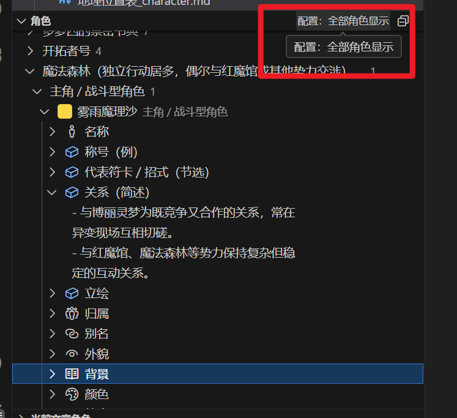
进入角色设置面板（当前文章角色设置步骤相同）
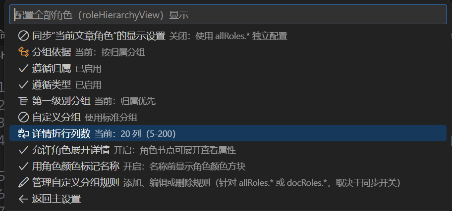
选择 详情折行行数
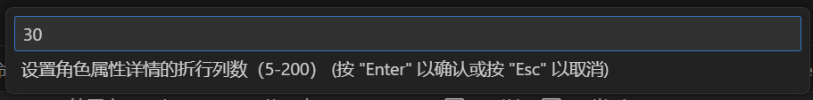
设置为一个合适的数值
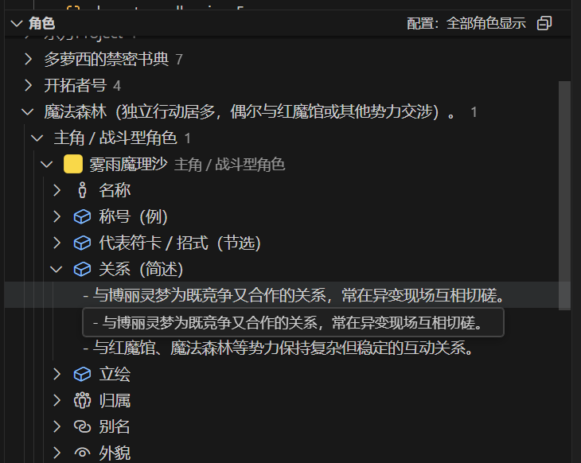
设置完成后手动刷新查看结果
（全部角色这边请来回切换是否跟随当前文章角色的设置来刷新，当前文章角色应该能自动刷新）

**目前版本设置完宽度后需要手动刷新才能应用 将会在下个版本修正**

### 角色详情展开与颜色图标

##### 角色详情展开

角色节点支持展开显示详细信息，便于快速查看和编辑角色属性：


- **展开机制**：点击角色节点旁边的展开图标（▶），可查看该角色的所有属性（如名称、类型、颜色、描述等）。
  
- **属性排序**：属性按键名排序，`name` 字段置顶，其余按字母顺序排列。
- **值显示**：长文本自动截断显示，完整内容在悬停提示中查看；支持换行和折行显示，避免单行过长。
- **配置开关**：通过 `AndreaNovelHelper.roles.details.enableRoleExpansion` 控制是否允许角色展开（默认开启）。

##### 根据角色颜色设置图标

为角色提供视觉化的颜色标识，提升界面辨识度：

- **颜色图标**：如果角色对象包含 `color`、`colour` 或 `颜色` 字段，系统会在角色名称前显示一个对应颜色的方块图标。
- **图标优先级**：优先使用角色自带的 SVG 图标（如果启用 `useRoleSvgIfPresent`）；否则使用颜色方块；最后回退到文件类型图标。
- **配置开关**：通过 `AndreaNovelHelper.docRoles.display.colorizeRoleName` 或 `AndreaNovelHelper.allRoles.display.colorizeRoleName` 控制是否启用颜色标记（默认关闭）。
- **视觉效果**：颜色方块为 14x14 像素的圆角矩形，支持透明度和边框，提供良好的视觉反馈。

这些功能增强了角色管理的交互体验，使角色列表更加直观和易于导航。配置开关允许用户根据需要启用或禁用这些特性。

### Andrea Novel Helper 自定义分组规则原理

> **注意 在此处设置和上面通过向导设置的结果是一样的 这边仅作为配置文件结构详解**

#### 1. 背景与作用

自定义分组功能允许你脱离内置“类型 → 归属 → 角色”三级结构，按照自己的规则（类型、归属或正则）来对角色进行分组，便于阅读、编辑和管理。

#### 2. 打开与作用域

- 下列配置可分别作用于两种视图：
  1. `allRoles`（全部角色视图）
  2. `docRoles`（当前文章角色视图，侧边栏 & Explorer）
- 配置路径（`settings.json`）示例：
  ```jsonc
  "AndreaNovelHelper.docRoles.useCustomGroups": true,
  "AndreaNovelHelper.docRoles.customGroups": [ /* 自定义分组列表 */ ],
  "AndreaNovelHelper.allRoles.syncWithDocRoles": false,
  "AndreaNovelHelper.allRoles.useCustomGroups": true,
  "AndreaNovelHelper.allRoles.customGroups": [ /* … */ ]
  ```

#### 3. 分组规则项字段

每个分组项是一个 JSON 对象，关键属性：

- `name`：组名，会展示在树视图顶层
- `matchType`: “type” | “affiliation” | “regex”
- `pattern`:
  - 当 `matchType=type` 或 `affiliation` 时，支持 glob 模式（`*Important*`）或逗号分隔列表
  - 当 `matchType=regex` 时，必须是一个 JS 正则字面量（`/^.*魔法.*$/`）
- `flat` (可选，不常用)：布尔，`true` 则该组下不再按“类型/归属”二级分组，直接平铺。一般不手动设置此字段，而是通过全局开关控制扁平化。
- `ignoreType` / `ignoreAffiliation` (可选)：布尔，若开启则该视图全局忽略二级“类型/归属”分层，仅在显示层面生效

```jsonc
{
  "name": "战斗角色",
  "matchType": "type",
  "pattern": "战斗*,Boss"
  // 注意：一般不设置 flat，而是通过全局开关控制
},
{
  "name": "魔法势力",
  "matchType": "affiliation",
  "pattern": "魔法森林,天空学院"
},
{
  "name": "自定义关键词",
  "matchType": "regex",
  "pattern": "/^Reimu|Marisa$/"
}
```

#### 4. 匹配与分组流程

1. **匹配阶段（Match）**  
   依照 `matchType`，用真实的角色 `type`、`affiliation` 或 `regex` 去筛选整个角色列表，不受全局的 `ignoreType`/`ignoreAffiliation` 开关影响，保证匹配准确。
2. **分组阶段（Group）**
   - 按配置项的顺序创建顶层组
   - 匹配到的角色按全局开关决定是否在同一组内直接平铺，或继续按二级维度（类型或归属）拆分
3. **其他角色（Other）**  
   将所有未命中的角色归入一个内置 “其他” 分组

#### 5. 忽略开关的效果（推荐使用）

全局开关是控制扁平化的主要方式：

- **`ignoreType=true`**：展示时不显示二级“类型”节点，所有角色直接平铺到所属顶层组。
- **`ignoreAffiliation=true`**：展示时不显示二级“归属”节点；若一个分组的 `matchType=affiliation`，并开启忽略，则所有匹配角色也会直接平铺到该组下。
- 这两个开关不影响匹配，只控制**展示层级**。

**推荐做法**：一般不手动设置每个分组的 `flat` 字段，而是通过全局的 `ignoreType` 和 `ignoreAffiliation` 开关来统一控制所有分组的扁平化行为。这样更简洁且易于管理。

#### 6. 同步与独立

- 当 `allRoles.syncWithDocRoles=true`，全部角色视图使用同一套 `docRoles.customGroups` 规则；
- 若需两者分别管理，设为 `false` 并分别配置。

#### 7. 示例配置

```jsonc
// settings.json
"AndreaNovelHelper.allRoles.syncWithDocRoles": false,
"AndreaNovelHelper.allRoles.useCustomGroups": true,
"AndreaNovelHelper.allRoles.customGroups": [
  {
    "name": "主角阵营",
    "matchType": "affiliation",
    "pattern": "勇者公会,救世教会"
  },
  {
    "name": "反派",
    "matchType": "type",
    "pattern": "Boss,精英*"
  }
],
// 推荐：通过全局开关控制扁平化，而不是手动设置 flat
"AndreaNovelHelper.allRoles.ignoreType": false,
"AndreaNovelHelper.allRoles.ignoreAffiliation": true  // 所有分组都会扁平化，不显示归属二级节点
```

#### 8. 注意事项

- 正则模式要写完整字面量，不能省略 `/.../`；
- `flat` 字段可选且不常用；一般通过全局 `ignoreType`/`ignoreAffiliation` 开关来控制扁平化；
- 如果一个角色同时命中多个组，按配置项先后顺序归入第一个匹配组；
- 未在 `customGroups` 中定义的字段会自动进入“其他”组；
- 修改分组配置后，可通过命令面板 “配置：全部角色显示” 或 “配置：当前文章角色显示” 立即刷新视图。

---
